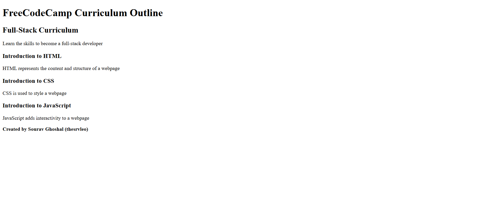

# FreeCodeCamp Curriculum Outline (HTML Project)

This is a beginner-friendly HTML project created as part of the FreeCodeCamp curriculum.

## 📸 Preview

This is a preview of the FreeCodeCamp Curriculum Outline HTML project created by Sourav Ghoshal.

## 📚 About the Project

This project demonstrates a simple curriculum outline using basic HTML structure including:

* Headings (h1, h2, h3)
* Paragraphs
* Semantic structure

## 🧠 What You Will Learn

* HTML basics
* How to structure a webpage
* Beginner-friendly layout techniques

## 🛠 Tech Used

* HTML5

## 🚀 Live Demo

https://thesrvleo.github.io/freecodecamp-curriculum-outline-html/

## 👨‍💻 Author

Sourav Ghoshal (thesrvleo)
GitHub: https://github.com/thesrvleo

## 🔍 SEO Keywords

freecodecamp solutions, html curriculum outline, beginner html project, sourav ghoshal, thesrvleo

## ⭐ Support

If this helped you, give it a ⭐ on GitHub.

## 📈 Use Case

Perfect for beginners looking for FreeCodeCamp HTML solutions.
